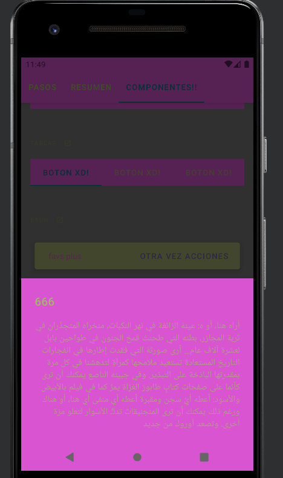
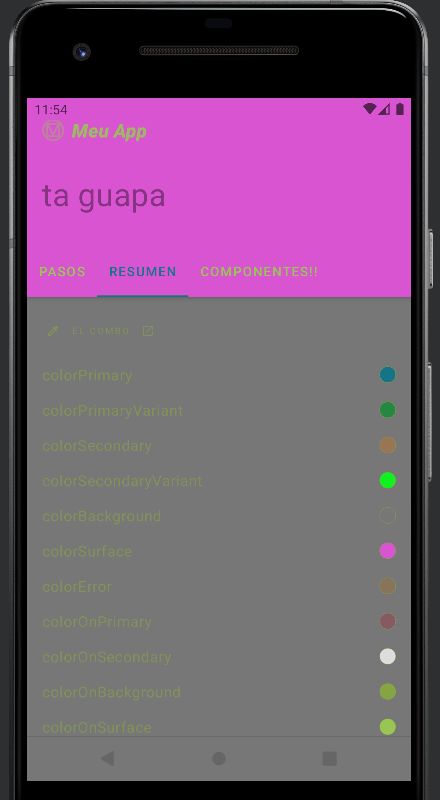
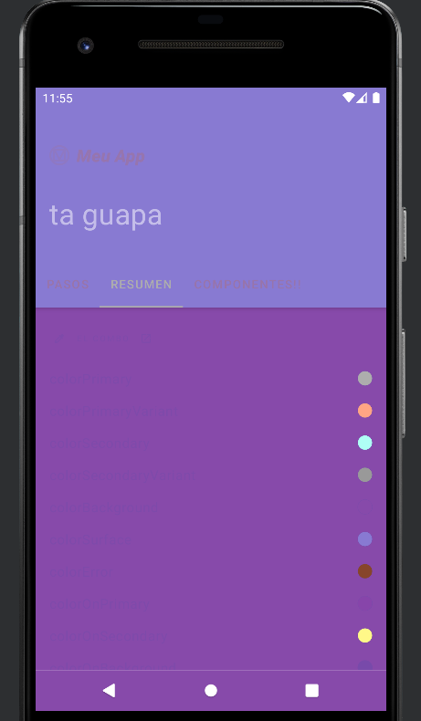

# Cambios realizados por Daniel García Ayala
Los cambios realizados han sido simples, comencemos con los textos.

##Textos cambiados
Para ello lo realizado fue indagar en el archivo strings.xml comparando los textos mostrados 
dentro de dicho archivos con los textos de la propia app al ejecutarla. Una vez ya comparados y sabiendo
a que hace referencia cada uno, procedí a cambiarlos como se puede ver en esta captura.

#Colores cambiados
Para los colores se realizaron dos cambios importantes, los cambios para el modo diurno y los cambios para el
modo oscuro.

Para el modo diurno procedí a realizar cambios en [values/themes.xml](./scr/main/res/values/themes.xml) para cambiar el aspecto general de la aplicación,
es decir, los colores primarios y secundarios para la misma.
Seguidamente en values/colors.xml también se realizaron cambios pero estos afectarían a ambos modos.

Para el modo nocturno, ví que existía una caperta llamada [values-night](./scr/main/res/values-night/themes.xml) la cual contenía un archivo themes.xml el cual
era igual que el diurno así que procedí a realizar los cambios.

